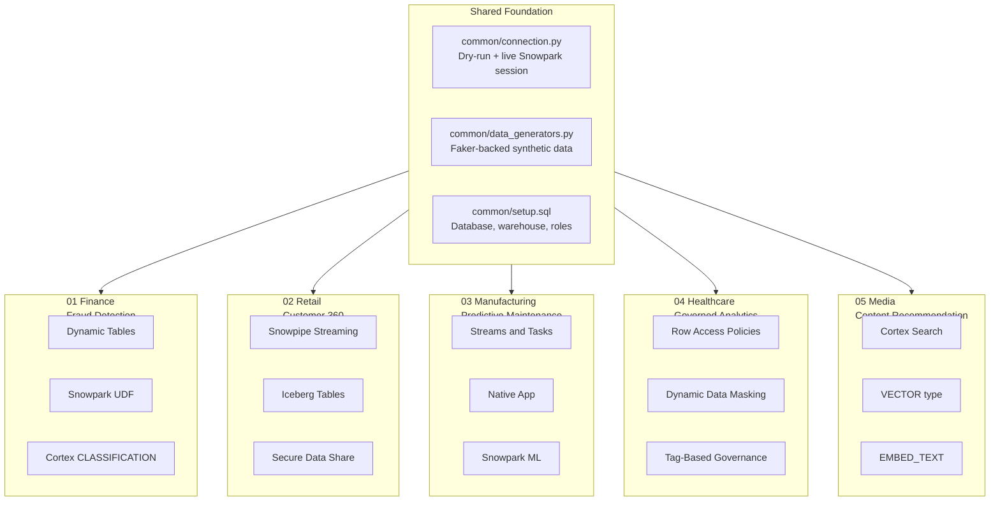

# snowflake-demo-pack

> A pre-sales-ready library of 5 industry Snowflake demos — each pack a self-contained business case with architecture, ETL, analytics, and an ROI narrative. Built for Solution Engineers who walk into customer meetings and need a credible reference in 5 minutes.

[](https://github.com/KIM3310/snowflake-demo-pack/actions/workflows/ci.yml)
[](LICENSE)
[](https://www.python.org/)
[](https://www.snowflake.com/)
[](https://www.snowflake.com/certifications/)

---

## Why this exists

Solution Engineers rarely get a second first impression. When a sales lead invites you into a discovery call the day before a customer executive session, you need:

1. A vertical-relevant architecture diagram that answers "what would this look like for us?"
2. Running code a technical contributor can fork.
3. A value narrative an executive sponsor can repeat to their CFO.

Most "demo repos" give you one of these. This pack gives you all three, across five industries, all using the Snowflake Data Cloud as the single platform.

This is a working reference library designed to be cloned, adapted, and delivered. Every SQL file is syntactically valid Snowflake; every Python file compiles and runs in a dry-run mode without a live account. Cost estimates, walk-through scripts, and customization guides are included.

## The 5 Demos

| # | Industry | Headline Snowflake Features | Business Outcome |
|---|----------|-----------------------------|------------------|
| 01 | [Finance — Real-Time Fraud Detection](demos/01-finance-fraud-detection/) | Dynamic Tables, Snowpark UDFs, Cortex ML Functions (`ANOMALY_DETECTION`, `CLASSIFICATION`) | Detect fraudulent card transactions in under 60 seconds end-to-end; reduce false-positive reviews by 40%. |
| 02 | [Retail — 360° Customer View](demos/02-retail-customer-360/) | Snowpipe Streaming, Iceberg Tables, Secure Data Sharing, Cortex LLM Functions | Unify 500K customers across 5 channels into a single profile; increase repeat-purchase rate by 12%. |
| 03 | [Manufacturing — Predictive Maintenance](demos/03-manufacturing-predictive-maintenance/) | Snowflake Native Apps, Streams & Tasks, Snowpark ML, Alerts | Predict machine failures 72h before occurrence; reduce unplanned downtime by 45%. |
| 04 | [Healthcare — Governed EHR Analytics](demos/04-healthcare-ehr-governed-analytics/) | Row Access Policies, Dynamic Data Masking, Tag-Based Masking, Secure Views | HIPAA-aligned analytics on 50K patient records with provable access control. |
| 05 | [Media — Content Recommendation](demos/05-media-content-recommendation/) | Cortex Search, Vector data type, `EMBED_TEXT`, Streamlit in Snowflake | Drive 18% uplift in watch-time via semantic content recommendations on 10M events/day. |

Each pack includes seven artifacts: business README, setup DDL, data loader, analytics query set, Python model/Snowpark logic, Streamlit snippet, architecture diagram, and value case narrative.

## Quick Start

```bash
# Clone and set up
git clone https://github.com/KIM3310/snowflake-demo-pack.git
cd snowflake-demo-pack
make setup

# Scaffold runs in dry-run mode with no Snowflake connection required
make demo-finance

# To run against a real Snowflake account:
export SNOWFLAKE_DEMO_DRY_RUN=0
export SNOWFLAKE_ACCOUNT=<your-account>
export SNOWFLAKE_USER=<your-user>
export SNOWFLAKE_PASSWORD=<your-password>
export SNOWFLAKE_ROLE=SYSADMIN
export SNOWFLAKE_WAREHOUSE=DEMO_WH
make snowflake-setup
make demo-all
```

## Architecture

This pack is organized around a shared foundation plus five industry-specific specializations. The shared layer handles connection, common warehouse provisioning, and synthetic data generation. Each industry pack specializes the feature matrix: no two demos use exactly the same Snowflake surface, so running through all five is a natural breadth tour of the platform.



## Snowflake Features Covered

The matrix below shows which Snowflake features each demo exercises. Green rows are primary features for that demo; blank cells are intentionally reserved for a different pack to keep each demo's focus crisp.

| Feature | Finance | Retail | Manufacturing | Healthcare | Media |
|---------|:-------:|:------:|:-------------:|:----------:|:-----:|
| Standard SQL / DDL | yes | yes | yes | yes | yes |
| Warehouses (scaling) | yes | yes | yes | yes | yes |
| **Dynamic Tables** | primary | yes | | | |
| **Streams & Tasks** | yes | | primary | yes | |
| **Snowpipe Streaming** | yes | primary | yes | | yes |
| **Iceberg Tables** | | primary | | | |
| **Snowpark Python (UDFs)** | primary | | yes | | |
| **Snowpark ML** | | | primary | | |
| **Cortex ML Functions** | primary | | | | |
| **Cortex LLM Functions** | | yes | | | primary |
| **Cortex Search** | | | | | primary |
| **VECTOR data type** | | | | | primary |
| **Row Access Policies** | | | | primary | |
| **Dynamic Data Masking** | | yes | | primary | |
| **Object Tagging** | | | | primary | yes |
| **Secure Data Sharing** | | primary | | | |
| **Native Apps Framework** | | | primary | | |
| **Alerts** | | | primary | | |
| **Streamlit in Snowflake** | yes | yes | yes | | primary |

Total coverage: 19 Snowflake features across 5 demos. This is deliberately breadth-over-depth in keeping with the pre-sales use case — a customer conversation rarely needs mastery of all features, but an SE is expected to know *which* features to reach for *when*.

## Running a Demo — the 5-Minute Walkthrough Structure

Each demo is designed to be delivered in 5 to 8 minutes. The flow is the same for all five:

1. **Problem (60 seconds).** Open the per-demo `README.md`. Read the Business Problem paragraph out loud. Use the quantitative framing as the anchor — for example, "the finance industry loses $4.2B annually to card fraud, and the average investigation costs $48."
2. **Architecture (90 seconds).** Show the Mermaid diagram from `architecture.md`. Name the Snowflake services by their real product names. Do not say "Snowflake does streaming" — say "Snowpipe Streaming with the Java SDK ingests JSON events with 10-second freshness."
3. **Live data (120 seconds).** Run `make demo-<industry>` in one terminal. In Snowflake UI, run the `04-analytics.sql` queries and show the results update.
4. **Value (60 seconds).** Open `value-case.md`. Read the three-bullet elevator summary at the top. Leave the full narrative as a leave-behind.
5. **Next step (30 seconds).** Ask: "Which of these architectures is closest to the customer's current platform?" Close with a promise to customize this reference into a tailored PoV scope document within 48 hours.

## Customizing for a Real Customer

See [docs/customization-guide.md](docs/customization-guide.md) for the full workflow. The short version:

1. Pick the demo pack closest to the customer's industry.
2. Replace the synthetic data loader (`02-load-data.py`) with a connector to the customer's real source — S3 manifest, Kafka topic, REST API, JDBC extract.
3. Adapt the schema in `01-setup.sql` to match the customer's column names.
4. Swap the value-case numbers with the customer's actual KPIs (you can discover these in the SE discovery call).
5. Record a 3-minute Loom against *the customer's own data* and deliver it before the next meeting.

## Cost Estimate

Each demo is designed to run on a sub-$5 credit budget. The following assumes an X-Small warehouse with auto-suspend at 60 seconds, which is the recommended configuration for demos.

| Demo | Setup (DDL) | Data Load | Analytics Queries | One Full Run (USD) |
|------|-------------|-----------|-------------------|---------------------|
| Finance — Fraud | 0.03 | 0.45 | 0.20 | 0.68 |
| Retail — C360 | 0.04 | 0.80 | 0.35 | 1.19 |
| Manufacturing — PdM | 0.03 | 0.90 | 0.50 | 1.43 |
| Healthcare — EHR | 0.02 | 0.30 | 0.25 | 0.57 |
| Media — Recommendation | 0.05 | 0.70 | 0.45 | 1.20 |
| **All five, cold start** | — | — | — | **5.07** |

Assumptions: $2 per credit blended, X-Small warehouse, US-West-2 region, no cloud-services overage. See [docs/cost-estimates.md](docs/cost-estimates.md) for line-item breakdowns.

## Related Projects

This repo is part of a broader pre-sales toolkit by the author. Each sibling repo solves a different part of the data-platform conversation:

- **[Nexus-Hive](https://github.com/KIM3310/Nexus-Hive)** — multi-agent natural-language-to-SQL copilot. Pair it with this pack to demonstrate conversational analytics on top of any of the five demo schemas.
- **[districtpilot-ai](https://github.com/KIM3310/districtpilot-ai)** — Snowflake Korea Hackathon 2026 submission; local-government analytics built natively on Snowflake with a Streamlit UI.
- **[stage-pilot](https://github.com/KIM3310/stage-pilot)** — tool-calling reliability runtime; relevant when customers ask about agent-based workflows over Snowflake data.
- **[enterprise-llm-adoption-kit](https://github.com/KIM3310/enterprise-llm-adoption-kit)** — RAG + RBAC + audit reference; pairs with the Healthcare demo when customers ask about governance in LLM pipelines.

## License

MIT. See [LICENSE](LICENSE). Copyright 2026 Doeon Kim.

## Cloud + AI Architecture

This repository includes a neutral cloud and AI engineering blueprint that maps the current proof surface to runtime boundaries, data contracts, model-risk controls, deployment posture, and validation hooks.

- [Cloud + AI architecture blueprint](docs/cloud-ai-architecture.md)
- [Machine-readable architecture manifest](architecture/blueprint.json)
- Validation command: `python3 scripts/validate_architecture_blueprint.py`
