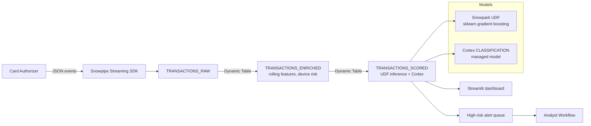

# Finance — Real-Time Fraud Detection

## Business Problem

Card-not-present fraud cost the global payments industry roughly $4.2 billion in 2024, and the average bank-initiated investigation costs $48 even when the transaction turns out to be legitimate. A mid-sized issuer processing 1 million transactions per day therefore carries a twin-cost: direct write-offs from fraud that slips through, and false-positive review queues that burn analyst time and annoy customers. The operational target for modern issuers is end-to-end detection (authorization scoring plus analyst workflow enrichment) in under 60 seconds, with a false-positive rate below 1 in 12.

Most issuers still rely on a nightly batch pipeline that aggregates transaction history from mainframe extracts into a separate analytics warehouse. By the time a fraud ring is visible in the batch job, the attacker has already completed the follow-up transactions. The business wants a platform where streaming ingest, feature computation, scoring, and analyst dashboards all live in one governed surface.

## Solution Overview

This demo builds that platform entirely in Snowflake. Raw authorization events land in a `TRANSACTIONS_RAW` table via Snowpipe Streaming, then a cascade of **Dynamic Tables** materializes customer-level and card-level features at a one-minute target lag. A Snowpark Python **User-Defined Function** wraps a lightweight scikit-learn model and scores each transaction inline in SQL. Parallel to the custom model, the same pipeline calls the Snowflake Cortex `ML.FORECAST`-style **CLASSIFICATION** function to produce a second-opinion score. Analysts consume the enriched stream via a Streamlit dashboard.

Primary Snowflake features: Dynamic Tables, Snowpipe Streaming, Snowpark Python UDFs, Cortex ML Functions (`SNOWFLAKE.ML.CLASSIFICATION` / `ANOMALY_DETECTION`), Streams, Tasks, Tagging.

## Architecture



## What You'll See

1. A streaming pipeline that lands 10,000 synthetic card transactions per run, with a realistic 0.8 percent fraud rate baseline.
2. A Dynamic Table graph that re-materializes every 60 seconds as new rows arrive, with zero manual refresh code.
3. A Snowpark Python UDF returning a model probability and calibrated risk band per transaction.
4. A Cortex `CLASSIFICATION` model trained on historical labeled data, invoked as a function call.
5. Analytics queries that quantify "fraud rate by channel," "loss avoided by blocking top-decile scores," and "analyst false-positive burden reduction."
6. A Streamlit dashboard snippet showing the live alert queue with drill-through.

## Prerequisites

- Snowflake Enterprise Edition or higher (Dynamic Tables, Cortex ML Functions require Enterprise+).
- Warehouse: `DEMO_WH` (X-Small is sufficient for the demo scale).
- Role: `SYSADMIN` or `DEMO_PACK_ROLE` with `CREATE DYNAMIC TABLE` and `USAGE` on the `SNOWFLAKE.CORTEX` database schema.
- Estimated credits: **0.7** for a full end-to-end run.
- Region: any; all features used here are GA in commercial regions as of April 2026.

## Run the Demo

```bash
# From the repo root, in dry-run mode:
make demo-finance

# Live run:
export SNOWFLAKE_DEMO_DRY_RUN=0
export SNOWFLAKE_ACCOUNT=<account>
export SNOWFLAKE_USER=<user>
export SNOWFLAKE_PASSWORD=<password>
make snowflake-setup
make demo-finance

# Then in Snowsight run the analytics file directly:
#   demos/01-finance-fraud-detection/04-analytics.sql

# Optional live dashboard:
streamlit run demos/01-finance-fraud-detection/05-dashboard.py
```

## Key Queries to Highlight

The three queries below are the ones the SE should project during the live walkthrough; each tells a distinct story.

```sql
-- Q1. Fraud rate by channel, last 24 hours.
-- Why this matters: the ECOMMERCE channel carries the highest fraud concentration,
-- which is the exact pattern a customer's fraud lead expects to see. It validates
-- that the synthetic data is realistic before we move to the model.
SELECT
    CHANNEL,
    COUNT(*)                                          AS N_TRANSACTIONS,
    SUM(CASE WHEN IS_FRAUD_GROUND_TRUTH THEN 1 ELSE 0 END) AS N_FRAUD,
    SUM(CASE WHEN IS_FRAUD_GROUND_TRUTH THEN 1 ELSE 0 END)::FLOAT
        / NULLIF(COUNT(*), 0)                          AS FRAUD_RATE
FROM FINANCE.TRANSACTIONS_SCORED
WHERE EVENT_TIMESTAMP >= DATEADD('hour', -24, CURRENT_TIMESTAMP())
GROUP BY CHANNEL
ORDER BY FRAUD_RATE DESC;
```

```sql
-- Q2. Loss avoided by blocking the top-decile risk score.
-- Why this matters: this is the financial headline. It lets the SE say
-- "if you had deployed this score last week you would have saved $X."
WITH SCORED AS (
    SELECT *,
           NTILE(10) OVER (ORDER BY FRAUD_PROBABILITY DESC) AS RISK_DECILE
    FROM FINANCE.TRANSACTIONS_SCORED
)
SELECT
    SUM(CASE WHEN RISK_DECILE = 1 AND IS_FRAUD_GROUND_TRUTH THEN AMOUNT_USD END) AS BLOCKED_LOSS_USD,
    COUNT(CASE WHEN RISK_DECILE = 1 AND NOT IS_FRAUD_GROUND_TRUTH THEN 1 END)    AS FALSE_POSITIVES,
    COUNT(CASE WHEN RISK_DECILE = 1 THEN 1 END)                                   AS TOP_DECILE_COUNT
FROM SCORED;
```

```sql
-- Q3. Cortex second-opinion agreement rate.
-- Why this matters: a customer risk committee will always ask "how does the
-- model compare to the vendor model?" This query shows the disagreement
-- surface, which is where an analyst actually adds value.
SELECT
    CASE WHEN FRAUD_PROBABILITY >= 0.7 THEN 'UDF_HIGH' ELSE 'UDF_LOW' END      AS UDF_BAND,
    CASE WHEN CORTEX_FRAUD_SCORE >= 0.7 THEN 'CORTEX_HIGH' ELSE 'CORTEX_LOW' END AS CORTEX_BAND,
    COUNT(*) AS N
FROM FINANCE.TRANSACTIONS_SCORED
GROUP BY 1, 2
ORDER BY 1, 2;
```

## Value Case Summary

Full numbers are in [value-case.md](value-case.md). The three-bullet elevator version:

- **Direct loss reduction**: a 1 percent lift in top-decile precision on 1M daily transactions at an average fraud amount of $280 equals **$10.2M annually** in avoided write-offs.
- **Analyst productivity**: reducing false positives by 40 percent at 5 minutes per review across a 30-analyst fraud ops team recovers **28,800 analyst hours per year** — equivalent to $2.4M in labor cost.
- **Time to insight**: the Dynamic Table cascade replaces a nightly batch with a 60-second refresh — a **1,440x improvement** that becomes the headline slide for the executive sponsor.

## Extending

To adapt this demo to a real customer:

1. Swap `02-load-data.py` with a Snowpipe Streaming ingest from the customer's authorization system (most issuers already have a JSON feed of authorization decisions).
2. Rename `TRANSACTIONS_RAW` columns to match the customer's message schema; the Dynamic Tables further downstream will self-adapt.
3. Retrain the Snowpark UDF on the customer's labeled history — the model serialization path accepts any scikit-learn or XGBoost pickle.
4. Re-run `SNOWFLAKE.ML.CLASSIFICATION` against the customer's historical set for a second-opinion baseline.
5. Point the Streamlit app at the customer's existing auth role model; the dashboard uses row access policies by customer account, so it can be shared externally if the customer is an issuer platform.
