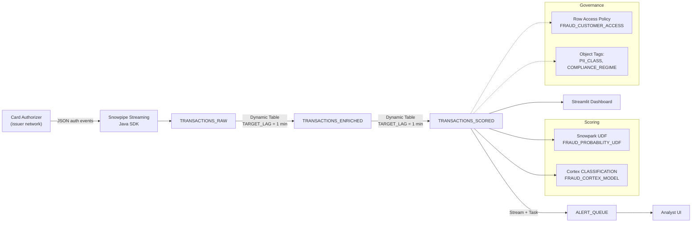

# Architecture — Finance Fraud Detection

## Component Diagram

## Ingest Layer

Authorization events arrive as JSON via Snowpipe Streaming. In a real customer deployment the source is typically a Kafka topic fed by the issuer's authorization service; Snowflake provides a Java SDK that commits rows with single-digit-second freshness. For the demo we simulate arrivals with a pandas-to-Snowpark write that keeps the logical boundary identical.

## Feature Layer

`TRANSACTIONS_ENRICHED` is a Dynamic Table with a one-minute target lag. Snowflake manages incremental refresh automatically; when new rows arrive, only the affected partitions recompute. The feature set focuses on fraud signals an SE can defend from first principles:

- **Velocity**: count of transactions on this card in the last hour.
- **Aggregate exposure**: sum of transaction amount in the last hour.
- **Geography dispersion**: distinct countries seen on this card in 24 hours.
- **Spend anomaly**: customer amount mean and standard deviation over 30 days, which feed a z-score at scoring time.
- **Binary risk flags**: high-risk country, e-commerce channel.

Adding a new feature is a single `ALTER DYNAMIC TABLE` statement — Snowflake re-plans the dependency graph automatically.

## Scoring Layer

`TRANSACTIONS_SCORED` is another Dynamic Table, one hop downstream. It invokes two inference engines side by side:

- The **Snowpark Python UDF** (`FRAUD_PROBABILITY_UDF`) loads a pickled scikit-learn `GradientBoostingClassifier` at cold start and returns a float in [0, 1]. This stands in for the customer's existing in-house model.
- The **Cortex `CLASSIFICATION` model** (`FRAUD_CORTEX_MODEL`) is trained declaratively from `TRANSACTIONS_LABELED_V` and gives a managed second opinion. The CLASSIFICATION function takes care of feature scaling and missing-value handling.

Having two models lets the analyst dashboard surface disagreement cells (high UDF, low Cortex) as the most valuable review candidates.

## Routing Layer

A `Stream` captures change rows on the enriched table. A `Task` scheduled every minute reads the stream, computes the score, and inserts qualifying rows (`FRAUD_PROBABILITY >= 0.60`) into `ALERT_QUEUE`. The task is left `SUSPENDED` after setup so the demo is cost-controlled; the SE resumes it during the walkthrough.

## Governance Layer

Two artifacts are provisioned but not attached by default:

- **Row Access Policy `FRAUD_CUSTOMER_ACCESS`** — lets an external issuer analyst see only rows for their own `CUSTOMER_ID`. Useful when this demo is extended into a multi-tenant issuer-platform conversation.
- **Object tags `PII_CLASS` and `COMPLIANCE_REGIME`** — tag the scored table with `MEDIUM` PII class and `PCI_DSS` compliance regime. The Healthcare demo uses the same tag vocabulary; this means the governance story is consistent across verticals.

## Consumption Layer

Two consumption surfaces are included:

- **04-analytics.sql** — seven canonical queries the SE projects during the live demo.
- **05-dashboard.py** — Streamlit app that runs either on a laptop or as a Streamlit-in-Snowflake native app. The dashboard has KPI tiles, a score-distribution histogram, and a live alert queue.

## Refresh and Latency Budget

| Stage | Expected latency | Mechanism |
|---|---|---|
| Auth event -> TRANSACTIONS_RAW | < 10 seconds | Snowpipe Streaming commit interval |
| TRANSACTIONS_RAW -> ENRICHED | <= 60 seconds | Dynamic Table target lag |
| ENRICHED -> SCORED | <= 60 seconds | Dynamic Table target lag |
| SCORED -> ALERT_QUEUE | <= 60 seconds | Task schedule |
| **End-to-end** | **under 3 minutes** | |

For demo purposes the SE can tune `TARGET_LAG` down to 30 seconds per Dynamic Table; the cost rises roughly linearly with inverse lag.

## Compute Sizing Guidance

The X-Small warehouse (`DEMO_WH`) handles the demo scale (10K transactions) comfortably. For a real 1M-transactions-per-day workload, a Small warehouse with a 10-second suspension is typically sufficient; the Dynamic Tables themselves run on the same warehouse.
