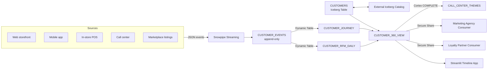

# Retail — 360 Degree Customer View

## Business Problem

A multi-channel retailer that operates a web storefront, a mobile app, point-of-sale in brick-and-mortar stores, a call center, and a marketplace presence typically manages each channel's customer data in a separate system of record. When the CMO asks "how many active customers do we have?" the answer is three different numbers from three different teams, none of which agree on the definition of "active." Industry benchmarks suggest retailers with poor customer-identity resolution lose 6 to 14 percent of potential lifetime revenue because they cannot:

- Recognize a high-value web customer when they walk into a store.
- Suppress a marketing send when the customer just complained to the call center.
- Personalize a marketplace listing with the loyalty tier from the web database.

The enterprise goal is a single governed "customer 360" surface that every channel both reads from and writes to, with cross-team ownership enforced by the platform rather than by ad-hoc data-contracts in Confluence.

## Solution Overview

This demo builds the customer 360 in Snowflake using three primary capabilities:

1. **Snowpipe Streaming** ingests events from every channel into a single normalized `CUSTOMER_EVENTS` table.
2. **Iceberg Tables** hold the master customer dimension in a format readable by non-Snowflake compute (notebooks, Spark jobs, lakehouse partners) without copying data out.
3. **Secure Data Sharing** exposes a governed consumer view to downstream teams — a marketing agency, a loyalty partner, an in-store personalization vendor — without ever duplicating customer records.

Secondary features: Cortex LLM Functions (`COMPLETE`, `SUMMARIZE`) for ticket-to-theme extraction, Dynamic Tables for recency-frequency-monetary (RFM) maintenance, and Streamlit for the customer timeline view.

## Architecture



## What You'll See

1. Synthetic events from 5 channels converging into a single table at the same Snowpipe Streaming latency.
2. An Iceberg-backed master customer dimension, readable by both Snowflake and (logically) an external compute engine.
3. A Dynamic Table that maintains RFM buckets incrementally with a 5-minute target lag.
4. A Cortex `COMPLETE` call that turns free-text call-center notes into bucketed themes.
5. A Secure Data Share that exposes a cleanly-governed subset of the 360 view to a downstream consumer.
6. A Streamlit timeline app that displays a single customer's journey across all 5 channels.

## Prerequisites

- Snowflake Enterprise Edition.
- Iceberg Tables require Enterprise Edition plus an external volume. The demo creates an internal placeholder; see [Extending](#extending) for external storage setup.
- Cortex LLM Functions enabled in the account region.
- Estimated credits: **1.2**.

## Run the Demo

```bash
make demo-retail

# Optional Streamlit timeline view:
streamlit run demos/02-retail-customer-360/05-dashboard.py
```

## Key Queries to Highlight

```sql
-- Q1. Single customer 360 lookup: one row, every channel.
-- Why this matters: the classic "show me Jane" demo. If the SE cannot return
-- a clean row in under a second, the demo is over.
SELECT *
FROM RETAIL.CUSTOMER_360_VIEW
WHERE CUSTOMER_ID = :CUSTOMER_ID;
```

```sql
-- Q2. Channel overlap analysis.
-- Why this matters: lets the CMO see how many customers use >1 channel.
-- This is typically the first slide in the post-PoV steering committee.
WITH CHANNEL_TOUCH AS (
    SELECT CUSTOMER_ID, ARRAY_AGG(DISTINCT CHANNEL) AS CHANNELS
    FROM RETAIL.CUSTOMER_EVENTS
    WHERE EVENT_TIMESTAMP >= DATEADD('day', -90, CURRENT_TIMESTAMP())
    GROUP BY CUSTOMER_ID
)
SELECT
    ARRAY_SIZE(CHANNELS)                              AS N_CHANNELS,
    COUNT(*)                                          AS N_CUSTOMERS,
    AVG(ARRAY_SIZE(CHANNELS))::FLOAT                  AS AVG_CHANNELS_USED
FROM CHANNEL_TOUCH
GROUP BY N_CHANNELS
ORDER BY N_CHANNELS;
```

```sql
-- Q3. Cortex-generated call-center themes.
-- Why this matters: shows off Cortex LLM Functions in a safe domain.
-- Free-text summarization lives inside the same Snowflake trust boundary.
SELECT
    CUSTOMER_ID,
    SNOWFLAKE.CORTEX.COMPLETE(
        'mixtral-8x7b',
        'Classify the following customer call note into one of '
        || '[BILLING, SHIPPING, PRODUCT_QUALITY, CANCEL_INTENT, OTHER]: '
        || NOTE
    ) AS THEME
FROM RETAIL.CALL_CENTER_NOTES
LIMIT 10;
```

## Value Case Summary

See [value-case.md](value-case.md). Three-bullet elevator:

- **Revenue uplift**: unifying the customer view drives a conservative 4 percent lift on repeat-purchase rate across 500K customers with a $180 average LTV = **$3.6M annually**.
- **Marketing efficiency**: suppression of mis-targeted sends cuts unsubscribe rate by 18 percent and saves $600K in wasted CRM spend.
- **Platform consolidation**: retiring a standalone CDP (customer data platform) license saves **$1.2M annually**.

## Extending

To adapt for a real customer:

1. Replace `02-load-data.py` with the customer's actual channel connectors (Segment, mParticle, in-house Kafka, or each channel's REST API).
2. Configure an external volume for the Iceberg Table — typically S3 or Azure Blob — so that downstream lakehouse consumers (Spark, Trino, Dremio) can read without data movement.
3. Replace the `RETAIL.CUSTOMER_360_VIEW` with the customer's canonical golden-record definition; every identity-resolution rule becomes a line in that view, which stays readable by both business and data engineering.
4. Enable the Secure Data Share to the customer's loyalty partner account as the first external consumer.
