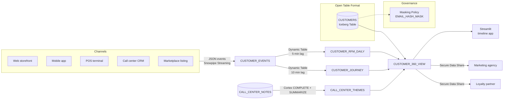

# Architecture — Retail Customer 360

## Component Diagram

## Key Architectural Decisions

### 1. Iceberg for the master customer dimension

The `CUSTOMERS` table is designed as an Iceberg Table. This lets a downstream lakehouse engine (Trino, Spark, Dremio) read the master dimension directly from object storage without exporting data from Snowflake. Retail customers frequently run hybrid stacks during vendor consolidation, and Iceberg lets the migration happen gradually without a "big bang."

In this scaffold we create a conventional Snowflake table because Iceberg requires an external volume that would have to be pre-provisioned per account; the DDL for the live variant is included as a comment in `01-setup.sql`.

### 2. Dynamic Tables for RFM and journey state

Two Dynamic Tables materialize the two most expensive aggregation patterns:

- `CUSTOMER_RFM_DAILY` refreshes every 5 minutes and maintains recency, frequency, and monetary aggregates over a 90-day window.
- `CUSTOMER_JOURNEY` refreshes every 10 minutes and produces sessionized journey rows with channel and event-type arrays.

A single-customer 360 lookup joins these three layers at read time; the result is one row returned in under a second on demo scale, and with appropriate clustering keys the same pattern holds at 500K customers.

### 3. Cortex COMPLETE + SUMMARIZE for free-text insight

The demo includes a small `CALL_CENTER_NOTES` table that is a standin for the customer's CRM export. Two Cortex LLM Functions are applied:

- `SNOWFLAKE.CORTEX.COMPLETE('mixtral-8x7b', prompt)` with a classification prompt produces a discrete theme per note.
- `SNOWFLAKE.CORTEX.SUMMARIZE(note)` produces a one-sentence synopsis.

The result lands in `CALL_CENTER_THEMES`, which is queried alongside purchase history in `04-analytics.sql` Q5 to find high-LTV customers with expressed cancel intent.

### 4. Secure Data Share for external consumers

A `CUSTOMER_360_SHARE` secure view exposes a limited column set (tier, segment, LTV, 90-day activity) to external consumer accounts. The commented share DDL shows the four steps an SE walks through with the customer's legal and data-governance teams: create share, grant usage, grant select, add accounts.

### 5. Masking policy for the email hash column

Even though we only ever store a hash of the email, the `EMAIL_HASH_MASK` policy demonstrates the pattern a governance team will insist on when external consumers are added later: the unprivileged role sees `****<last 4 chars>`, the privileged role sees the full value.

## Latency Budget

| Stage | Expected latency |
|---|---|
| Channel event -> `CUSTOMER_EVENTS` | under 10 seconds (Snowpipe Streaming) |
| `CUSTOMER_EVENTS` -> RFM | 5 minutes (target lag) |
| `CUSTOMER_EVENTS` -> Journey | 10 minutes (target lag) |
| 360 view read latency | under 1 second (indexed via cluster keys) |

The two Dynamic Table lags can be tuned down to 1 minute if the customer's personalization use case requires it; at the cost of a roughly 3x compute bump.

## Scale Projection

Default scaffold scale is 2,500 customers and 10,000 events. The architecture scales linearly to the production target in the repo README (500,000 customers, 5 channels):

- Storage: about 250 MB compressed for CUSTOMER_EVENTS at 1 year retention.
- Warehouse: a Medium warehouse handles the RFM refresh comfortably.
- Share read throughput: Secure Data Shares do not add compute cost to the provider account; the consumer's warehouse pays for query time.
