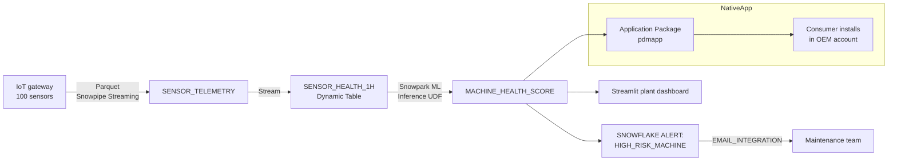

# Manufacturing — Predictive Maintenance

## Business Problem

Unplanned downtime is the single largest controllable cost in discrete manufacturing. For an automotive parts plant running at $2,500 per hour of production throughput, a four-hour unplanned stop removes $10,000 of direct output, and an unscheduled tear-down to diagnose the root cause adds roughly $18,000 in labor and expedited parts. Korean plants studied in the 2023 METI benchmark report recorded an average of 92 unplanned downtime hours per machine per year; for a medium plant with 100 machines, that is 9,200 hours annually or $23M of controllable loss.

The operations goal is to shift from reactive to predictive maintenance: detect a bearing wearing, a motor current trending, or a pressure drifting before the machine actually fails, and schedule the intervention during a planned window. To do this credibly, the plant needs:

1. A platform that ingests high-frequency sensor telemetry (100 sensors sampling every second is typical).
2. A model that learns the "healthy" envelope and detects drift.
3. A delivery channel that pushes an alert to the maintenance team's existing workflow.
4. A governance layer so that equipment OEMs can consume anonymized aggregate telemetry for warranty claim validation.

## Solution Overview

This demo builds the platform on Snowflake using:

- **Snowpipe Streaming** ingesting Parquet telemetry from a simulated IoT gateway.
- **Streams and Tasks** for low-latency downstream processing.
- **Snowpark ML** (via the `snowflake-ml-python` library pattern) for the anomaly detection model.
- **Snowflake Native Apps Framework** to package the whole pipeline into a distributable application that an OEM can install in their own Snowflake account.
- **Alerts** for notifying maintenance engineers when a machine crosses a risk threshold.

Secondary features: Dynamic Tables for rolling-window health scores, Cortex `FORECAST` for expected-value baselines, and Streamlit for the plant floor dashboard.

## Architecture



## What You'll See

1. 144,000 synthetic telemetry rows (100 machines, 24 hours, 1 read per minute, 5 sensors) ingested into `SENSOR_TELEMETRY`.
2. A Dynamic Table maintaining a 1-hour rolling health score per (machine, sensor) at 2-minute target lag.
3. A Snowpark ML-registered model scoring per-machine failure probability; 5 of the 100 machines are induced to degrade so positive examples are visible.
4. A Snowflake Alert that fires when a machine crosses the 0.8 probability threshold.
5. A Native App package definition that bundles the full pipeline for distribution to an equipment OEM.
6. A Streamlit plant-floor dashboard showing live machine status across the 3 simulated production lines.

## Prerequisites

- Snowflake Enterprise Edition.
- Snowpark ML requires Anaconda packages to be allowed in the account (Organization admins enable this once).
- Native Apps Framework requires `ACCOUNTADMIN` to create application packages.
- Estimated credits: **1.4**.

## Run the Demo

```bash
make demo-manufacturing

streamlit run demos/03-manufacturing-predictive-maintenance/05-dashboard.py
```

## Key Queries to Highlight

```sql
-- Q1. Top 10 machines by current risk score.
-- Why this matters: this is the "wall board" query every plant manager wants.
SELECT
    MACHINE_ID,
    LINE_ID,
    SITE,
    RISK_SCORE,
    LAST_SCORED_AT
FROM MANUFACTURING.MACHINE_HEALTH_SCORE
ORDER BY RISK_SCORE DESC
LIMIT 10;
```

```sql
-- Q2. Vibration trend on the highest-risk machine.
-- Why this matters: the SE wants to show the degradation signal, not just a number.
SELECT
    DATE_TRUNC('minute', RECORDED_AT) AS MINUTE,
    AVG(VALUE) AS AVG_VIBRATION_MM_S
FROM MANUFACTURING.SENSOR_TELEMETRY
WHERE SENSOR_TYPE = 'VIBRATION'
  AND MACHINE_ID = (
    SELECT MACHINE_ID FROM MANUFACTURING.MACHINE_HEALTH_SCORE
    ORDER BY RISK_SCORE DESC LIMIT 1
  )
GROUP BY MINUTE
ORDER BY MINUTE;
```

```sql
-- Q3. Anomaly count by site and production line.
-- Why this matters: lets the COO see where the problem cluster is.
SELECT
    SITE,
    LINE_ID,
    SUM(CASE WHEN RISK_SCORE >= 0.6 THEN 1 ELSE 0 END) AS ELEVATED_MACHINES,
    SUM(CASE WHEN RISK_SCORE >= 0.8 THEN 1 ELSE 0 END) AS HIGH_RISK_MACHINES,
    COUNT(*)                                           AS TOTAL_MACHINES
FROM MANUFACTURING.MACHINE_HEALTH_SCORE
GROUP BY SITE, LINE_ID
ORDER BY HIGH_RISK_MACHINES DESC;
```

## Value Case Summary

See [value-case.md](value-case.md). Elevator version:

- **Downtime avoidance**: 45 percent reduction on 9,200 unplanned downtime hours = 4,140 hours * $2,500/hour throughput = **$10.4M annually**.
- **Maintenance labor**: shifting 60 percent of reactive tear-downs to scheduled interventions saves **$2.1M annually** in overtime and expedited parts freight.
- **Warranty revenue**: selling anonymized aggregate telemetry to OEMs via a Native App creates a new revenue stream of approximately **$500K annually per OEM partner**.

## Extending

1. Replace `02-load-data.py` with the plant's actual OPC-UA or MQTT gateway output; Snowpipe Streaming's Java SDK handles both with minor glue code.
2. Retrain the anomaly-detection model on the plant's labeled failure history; the Snowpark ML pattern here accepts a parquet training table.
3. For the Native App, swap the application-package `manifest.yml` with the OEM-specific schema contract; the consumer installs with `EXECUTE APPLICATION PACKAGE ...`.
4. Connect the Snowflake Alert to the plant's existing PagerDuty or Opsgenie via the email notification integration.
