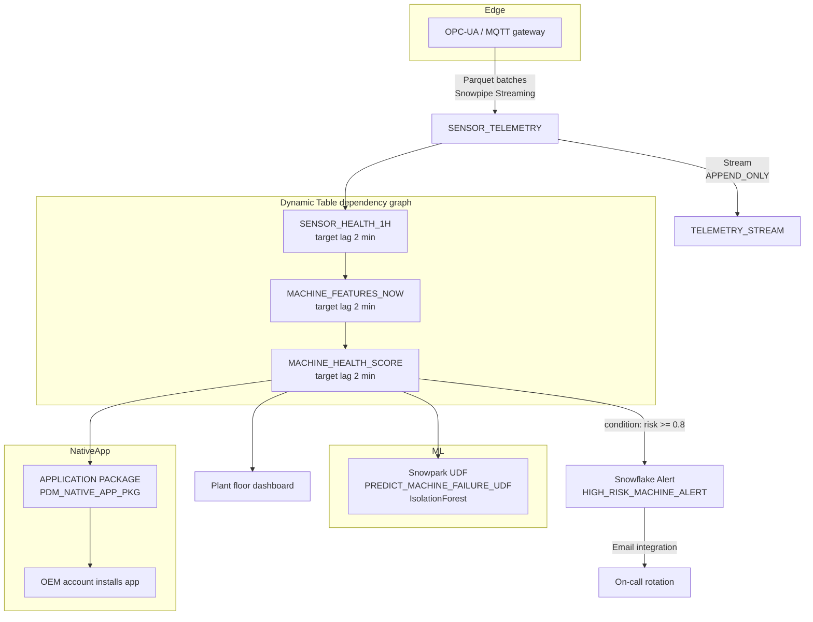

# Architecture — Manufacturing Predictive Maintenance

## Component Diagram

## Ingest Layer

Telemetry is delivered from an edge gateway in Parquet batches via Snowpipe Streaming. In production the edge device sends micro-batches of ~1,000 rows every 10 seconds; the SDK commits them to `SENSOR_TELEMETRY` within a second. The raw table is clustered on `(RECORDED_AT, MACHINE_ID)` so per-machine reads stay efficient as the table grows.

An `APPEND_ONLY` Stream sits on top of the raw table. Append-only semantics skip the delta-tracking overhead of a standard stream, which is the right choice here because telemetry is inherently append-only.

## Feature Pipeline

Three Dynamic Tables run in a cascade:

- `SENSOR_HEALTH_1H` — per-minute rollups per sensor over the trailing hour.
- `MACHINE_FEATURES_NOW` — machine-level flattened feature row; pivots the 5 sensor types into 7 scalar features (5 means + 2 maxes).
- `MACHINE_HEALTH_SCORE` — joins features to the inference UDF.

All three share a 2-minute target lag. Snowflake's Dynamic Table engine handles the DAG scheduling and incremental refresh.

## Scoring Layer

`PREDICT_MACHINE_FAILURE_UDF` is a Snowpark Python UDF that loads a pickled `IsolationForest` at cold start. The UDF returns a score in [0, 1] where 1 is maximum anomaly. In a live deployment we would migrate this to the Snowpark ML Model Registry so the model artifact is version-controlled and auditable.

## Alerting Layer

A Snowflake Alert named `HIGH_RISK_MACHINE_ALERT` runs every 5 minutes. Its condition checks for any machine where `RISK_SCORE >= 0.8` with a `LAST_SCORED_AT` inside the last 10 minutes. When the condition is true, the alert's body calls `SYSTEM$SEND_EMAIL` through a pre-provisioned email notification integration.

The alert is created `SUSPENDED` in the setup script so the demo does not send any email on day one.

## Distribution via Native Apps

The `PDM_NATIVE_APP_PKG` application package lets us ship the pipeline to equipment OEMs as a Snowflake Native App. In practice the OEM:

1. Installs the app into their Snowflake account.
2. Grants their telemetry schema to the app.
3. Views aggregated and anonymized health metrics in the app's provided UI.

The OEM pays a subscription fee via the Snowflake Marketplace, creating a new revenue stream for the plant operator (or for a 3rd-party service provider building on top of the operator's data). This is the "from reactive maintenance to data product" narrative that resonates with operations leadership.

## Latency Budget

| Stage | Target latency |
|---|---|
| Sensor sample -> `SENSOR_TELEMETRY` | < 10 seconds |
| `SENSOR_TELEMETRY` -> `SENSOR_HEALTH_1H` | <= 2 minutes |
| `SENSOR_HEALTH_1H` -> `MACHINE_FEATURES_NOW` | <= 2 minutes |
| `MACHINE_FEATURES_NOW` -> `MACHINE_HEALTH_SCORE` | <= 2 minutes |
| **End to end** | **< 10 minutes** |

For plants with stricter SLAs the target lag can be tightened to 30 seconds per Dynamic Table.

## Compute Sizing

At 100 machines, 5 sensors, 1 read per second (production target), the pipeline ingests ~43M rows per day. A Medium warehouse handles the feature cascade with room to spare; the inference UDF is the dominant cost and can be horizontally scaled by enabling warehouse multi-clustering.
