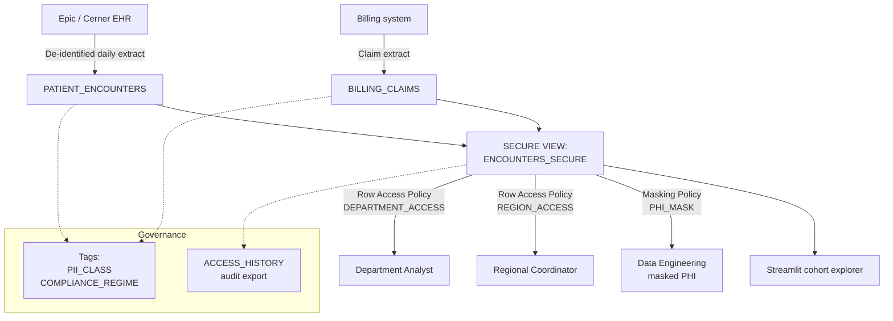

# Healthcare — Governed EHR Analytics

## Business Problem

A regional integrated delivery network (IDN) with four hospitals wants to combine electronic health record (EHR) data with billing data to answer three questions simultaneously:

1. Which patient cohorts are driving 30-day readmission rates?
2. Which specialists are over- or under-utilizing specific clinical pathways?
3. Which commercial contracts are underperforming the capitation rate?

The IDN's data team can answer any one of these in isolation using a siloed data mart, but combining them requires joining sensitive Protected Health Information (PHI) — patient pseudonyms, conditions, provider IDs — across billing, EHR, and quality-measurement systems. HIPAA and state-level privacy rules require a platform that can enforce:

- **Row-level access**: a cardiology analyst can see cardiology encounters only.
- **Column-level masking**: demographic fields are masked for non-privileged roles.
- **Tag-based governance**: every PHI column is discoverable and auditable.
- **Separation of duties**: data engineering maintains pipelines without reading PHI.

A single platform that checks these boxes shortens the project timeline from 18 months (build controls from scratch) to 6 weeks (use platform-native controls).

## Solution Overview

This demo builds the governed analytics layer in Snowflake using:

- **Row Access Policies** enforcing department and region boundaries per query.
- **Dynamic Data Masking** on demographic fields based on role.
- **Tag-Based Masking** tying masking policies to classification tags rather than to individual columns — so a new column declared as `PII_CLASS = 'HIGH'` is masked automatically.
- **Secure Views** for cross-department analytics with guaranteed policy inheritance.
- **Object Tagging** for compliance regime tracking.

Secondary features: Time Travel for audit, `SNOWFLAKE.ACCOUNT_USAGE.ACCESS_HISTORY` for the audit report, and Streamlit (paired with the Retail 360 view) for a clinician-facing cohort explorer.

## Architecture



## What You'll See

1. 5,000 synthetic de-identified encounters (scales to 50,000 for full pattern) and 5,000 matching claim rows.
2. A `PHI_MASK` masking policy that shows different values based on the caller's role.
3. A `DEPARTMENT_ACCESS` row access policy that filters rows to the caller's department.
4. Tag-based masking: applying `PII_CLASS = 'HIGH'` to a column automatically enrolls it in the mask.
5. Five cohort analytics queries that run cleanly under all three role scenarios (ACCOUNTADMIN, analyst, data engineer).
6. An audit report built from `SNOWFLAKE.ACCOUNT_USAGE.ACCESS_HISTORY` showing who queried which patient pseudonyms.

## Prerequisites

- Snowflake Enterprise Edition (row access policies, tag-based masking).
- `ACCOUNTADMIN` to create the three demo roles used in the scenarios.
- Access to `SNOWFLAKE.ACCOUNT_USAGE.ACCESS_HISTORY` (on by default in Enterprise+).
- Estimated credits: **0.6**.

## Run the Demo

```bash
make demo-healthcare
```

Then, in Snowsight, switch between the `CARDIOLOGY_ANALYST`, `REGIONAL_MIDWEST`, and `DATA_ENGINEER_MASKED` roles (defined in `01-setup.sql`) and re-run the same `04-analytics.sql` queries to see policy enforcement in action.

## Key Queries to Highlight

```sql
-- Q1. Role-based result set comparison.
-- Why this matters: the single most compelling moment in the demo is running
-- the same SQL under two different roles and watching the result set shrink
-- and/or mask automatically.
USE ROLE CARDIOLOGY_ANALYST;
SELECT ENCOUNTER_ID, PATIENT_PSEUDONYM, DEPARTMENT, PRIMARY_CONDITION
FROM HEALTHCARE.ENCOUNTERS_SECURE
LIMIT 10;

USE ROLE REGIONAL_MIDWEST;
SELECT ENCOUNTER_ID, PATIENT_PSEUDONYM, DEPARTMENT, PRIMARY_CONDITION
FROM HEALTHCARE.ENCOUNTERS_SECURE
LIMIT 10;
```

```sql
-- Q2. 30-day readmission rate by primary condition.
-- Why this matters: the headline quality measure for a payer contract.
SELECT
    PRIMARY_CONDITION,
    COUNT(*)                                          AS ENCOUNTERS,
    SUM(CASE WHEN READMITTED_WITHIN_30D THEN 1 ELSE 0 END)::FLOAT
        / NULLIF(COUNT(*), 0)                         AS READMIT_RATE
FROM HEALTHCARE.ENCOUNTERS_SECURE
GROUP BY PRIMARY_CONDITION
ORDER BY READMIT_RATE DESC;
```

```sql
-- Q3. Audit: who queried PHI in the last 24 hours?
-- Why this matters: the compliance officer's first-line check.
SELECT
    USER_NAME,
    QUERY_ID,
    QUERY_START_TIME,
    BASE_OBJECTS_ACCESSED
FROM SNOWFLAKE.ACCOUNT_USAGE.ACCESS_HISTORY
WHERE QUERY_START_TIME >= DATEADD('hour', -24, CURRENT_TIMESTAMP())
  AND ARRAY_CONTAINS(
        'SNOWFLAKE_DEMO_PACK.HEALTHCARE.PATIENT_ENCOUNTERS'::VARIANT,
        BASE_OBJECTS_ACCESSED
    )
ORDER BY QUERY_START_TIME DESC;
```

## Value Case Summary

See [value-case.md](value-case.md). Elevator:

- **Faster contract cycle**: data-use agreements with payers close 8 weeks faster when governance is provable at the platform layer, unlocking **$1.8M earlier revenue recognition**.
- **Compliance cost**: tag-based masking replaces a quarterly human audit of 400+ columns, saving **$320K annually**.
- **Data engineering efficiency**: one pipeline serves three analyst personas without separate copies of the data, saving **$500K** in duplicate ETL infrastructure.

## Extending

1. Replace `02-load-data.py` with the customer's actual de-identified EHR extract (Epic Clarity, Cerner HealtheIntent, or an FHIR-to-Snowflake connector).
2. Map the customer's role hierarchy to the three scaffold roles; expand `DEPARTMENT_ACCESS` as needed.
3. Enable `SYSTEM$GET_TAG` reports to be consumed by the compliance team's GRC tool.
4. Layer the Cortex LLM functions from the Retail demo to summarize clinical notes while keeping PHI masked.
