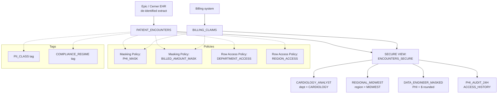

# Architecture — Governed EHR Analytics

## Component Diagram



## Policy Inheritance Rules

Snowflake guarantees that masking and row access policies applied to a base table propagate through views and secure views. This scaffold relies on that guarantee:

- Base tables: `PATIENT_ENCOUNTERS`, `BILLING_CLAIMS`.
- Secure view: `ENCOUNTERS_SECURE` joins the two.
- Analysts only have SELECT on the secure view; they never see the base tables.

When a `CARDIOLOGY_ANALYST` runs `SELECT * FROM ENCOUNTERS_SECURE`:

1. The view expands to a join of the base tables.
2. The row access policy `DEPARTMENT_ACCESS` filters to `DEPARTMENT = 'CARDIOLOGY'`.
3. The masking policy `PHI_MASK` rewrites `PATIENT_PSEUDONYM` to its SHA-256.
4. The masking policy `BILLED_AMOUNT_MASK` passes through (analysts see the real amount).

The same view under `DATA_ENGINEER_MASKED`:

1. Rows are not filtered (engineer sees the whole shape of the data).
2. `PATIENT_PSEUDONYM` renders as `***MASKED***`.
3. `BILLED_AMOUNT_USD` rounds to the nearest $1,000.

## Tag-Based Masking

Object tags (`PII_CLASS`, `COMPLIANCE_REGIME`) are defined once in `common/setup.sql`. In production, tags drive automatic policy attachment:

```sql
CREATE OR REPLACE MASKING POLICY CLASSIFIED_PHI_MASK AS (VAL STRING)
    RETURNS STRING ->
    CASE WHEN CURRENT_ROLE() IN ('ACCOUNTADMIN') THEN VAL ELSE '***' END;

ALTER TAG PII_CLASS SET MASKING POLICY CLASSIFIED_PHI_MASK;
```

After this, any column tagged `PII_CLASS = 'HIGH'` is masked automatically even if the analyst adds a new column tomorrow. The governance team only maintains the tag vocabulary, not per-column policy attachments. This is how Snowflake scales governance to large schemas.

## Roles in the Demo

| Role | Row filter | Column masks | Intent |
|---|---|---|---|
| SYSADMIN | none | none | Platform admin for demo-setup only |
| CARDIOLOGY_ANALYST | department = CARDIOLOGY | PHI -> SHA-256 | A cardiology-only analyst |
| REGIONAL_MIDWEST | region = MIDWEST | PHI -> SHA-256 | A cross-department regional role |
| DATA_ENGINEER_MASKED | none | PHI fully masked; amounts rounded | Pipeline engineer without clinical context |

## Audit Layer

`PHI_AUDIT_24H` wraps `SNOWFLAKE.ACCOUNT_USAGE.ACCESS_HISTORY` and filters to queries that touched `PATIENT_ENCOUNTERS` in the last 24 hours. This is the view a compliance officer runs during their weekly tour. In production the compliance team typically schedules it as a Task with results exported to their GRC system.

## Why This Matters for the Customer

Healthcare customers cannot buy a platform on the strength of analytics alone. The gating question is "how do you prove only the right people saw the right rows?" This demo answers that question three ways:

1. **Live demonstration** — running the same SQL under two different roles shows different results.
2. **Tag-driven governance** — the governance team does not have to maintain policies per column.
3. **Built-in audit** — `ACCESS_HISTORY` provides a first-class record without a separate SIEM.

## Scale Projection

The scaffold is 5,000 encounters and 5,000 claims. At a real integrated delivery network (IDN):

- 50,000 encounters/month is typical for a mid-size IDN.
- 1 year of rolling data = 600K encounters, which is still comfortably handled by an X-Small warehouse.
- Secure-view read latency remains under 500ms when `PATIENT_ENCOUNTERS` is clustered by `(ENCOUNTER_TIMESTAMP, DEPARTMENT)`.
