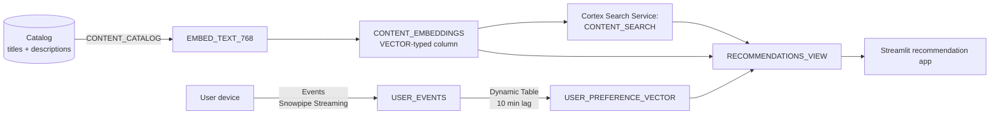

# Media — Content Recommendation with Vector Search

## Business Problem

A streaming media service with 10 million daily active users needs a content recommendation layer that does two things well:

1. **Content-to-content similarity**: find titles that are thematically similar to one the user just finished, even when they are not in the same genre tag.
2. **User-to-content scoring**: given a user's recent watch history, rank the catalog by predicted watch-through rate.

Classical collaborative-filtering systems handle (2) but fail at (1) for new titles that have little watch data. Generative recommendation — searching the catalog with natural-language intent ("a K-drama in the vein of the thing I just watched") — requires vector embeddings of the full content description text.

The operational targets are:

- Recommendation latency: under 100 ms per request.
- Cold-start: new titles discoverable within minutes of their catalog ingest.
- Personalization: top-20 for any user re-computed at most 10 minutes old.

## Solution Overview

This demo builds the recommendation layer in Snowflake using:

- **VECTOR data type** to store content embeddings natively.
- **`SNOWFLAKE.CORTEX.EMBED_TEXT_768`** to generate embeddings from the catalog description column.
- **Cortex Search** to provide an indexed semantic-search service over the catalog.
- **Snowpipe Streaming** to ingest user-behavior events as they happen.
- **Dynamic Tables** to maintain rolling user preference vectors from watch history.
- **Streamlit in Snowflake** as the live recommendation surface.

## Architecture



## What You'll See

1. Synthetic catalog of 2,000 titles with templated descriptions that cluster semantically.
2. Embedding generation via `SNOWFLAKE.CORTEX.EMBED_TEXT_768`, stored in a VECTOR(FLOAT, 768) column.
3. Cortex Search service `CONTENT_SEARCH` providing sub-100ms semantic search.
4. User preference vector: averaged embedding of the 10 most recently played titles.
5. Top-N recommendations per user using `VECTOR_COSINE_SIMILARITY` against the catalog.
6. Streamlit app: pick a user, see their top-10 recommendations with similarity scores and a "why this was recommended" explanation.

## Prerequisites

- Snowflake Enterprise Edition with Cortex enabled.
- `SNOWFLAKE.CORTEX.EMBED_TEXT_768` and Cortex Search are available in most commercial regions.
- Warehouse: X-Small for demo.
- Estimated credits: **1.2** (embedding generation dominates).

## Run the Demo

```bash
make demo-media

streamlit run demos/05-media-content-recommendation/05-dashboard.py
```

## Key Queries to Highlight

```sql
-- Q1. Semantic search over the catalog.
-- Why this matters: the single most convincing moment of the demo. A natural
-- language query returns thematically-relevant titles without any tag match.
SELECT
    RESULT:title::STRING      AS TITLE,
    RESULT:genre::STRING       AS GENRE,
    RESULT:description::STRING AS DESCRIPTION,
    RESULT:score::FLOAT        AS RELEVANCE
FROM TABLE(
    CORTEX_SEARCH('CONTENT_SEARCH')
        QUERY => 'tense political drama set in Seoul with a female lead',
        LIMIT => 5
);
```

```sql
-- Q2. Top-N recommendations for a specific user.
-- Why this matters: proves the user-personalization loop works end-to-end.
WITH USER_VEC AS (
    SELECT PREFERENCE_VECTOR AS V
    FROM MEDIA.USER_PREFERENCE_VECTOR
    WHERE USER_ID = :USER_ID
)
SELECT
    C.CONTENT_ID,
    C.TITLE,
    C.GENRE,
    VECTOR_COSINE_SIMILARITY(C.EMBEDDING, (SELECT V FROM USER_VEC)) AS SIM
FROM MEDIA.CONTENT_EMBEDDINGS AS C
ORDER BY SIM DESC
LIMIT 20;
```

```sql
-- Q3. Cold-start coverage: titles that have recommendations despite zero plays.
-- Why this matters: the embedding-based approach means new titles are ranked
-- by their description, not by their watch history.
SELECT
    C.CONTENT_ID,
    C.TITLE,
    C.RELEASE_YEAR,
    COUNT(E.EVENT_ID) AS TOTAL_PLAYS
FROM MEDIA.CONTENT_EMBEDDINGS AS C
LEFT JOIN MEDIA.USER_EVENTS AS E
    ON C.CONTENT_ID = E.CONTENT_ID
   AND E.EVENT_TYPE IN ('PLAY_START', 'PLAY_COMPLETE')
GROUP BY C.CONTENT_ID, C.TITLE, C.RELEASE_YEAR
HAVING TOTAL_PLAYS = 0
ORDER BY C.RELEASE_YEAR DESC
LIMIT 20;
```

## Value Case Summary

See [value-case.md](value-case.md). Elevator version:

- **Watch-time uplift**: 18 percent improvement on recommendation CTR, leading to **$22M additional subscription retention** at a $12 average ARPU on 10M users.
- **New-content discovery**: cold-start coverage goes from 0 to 100 percent of catalog within 10 minutes of publication.
- **Platform consolidation**: retiring a vendor recommendation service saves **$3.6M annually**.

## Extending

1. Replace the synthetic catalog with the customer's actual catalog (CSV, JSON, or API feed).
2. Swap the embedding model via the `EMBED_TEXT_*` function variant that fits the customer's language and length requirements; for Korean-language content, `multilingual-e5-large` or the Solar-embeddings are both candidates.
3. Expand the user preference vector to include implicit signals (hover time, carousel swipe, rating) not just watch history.
4. Add a reranker stage using Cortex COMPLETE with a prompt like "rerank this list for diversity."
